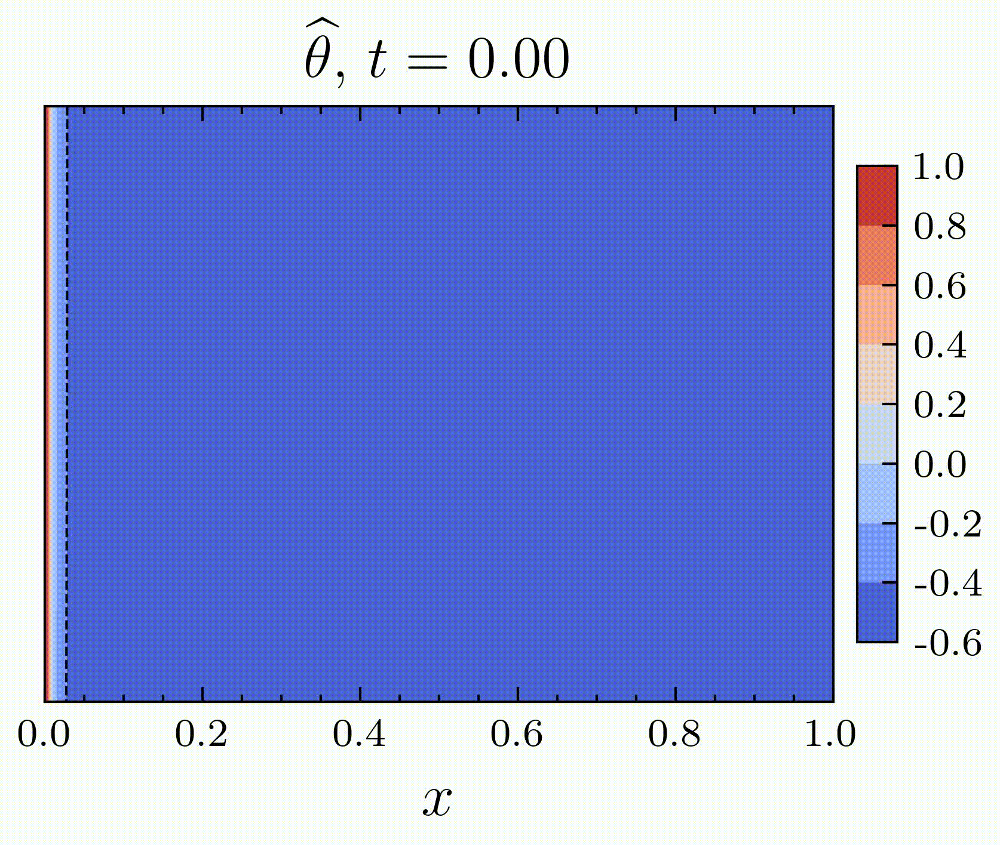

# Stefan's Problem
<!--


-->
The mathematical description of phase change phenomena can be introduced through an idealized framework in which the transition between two distinct phases (e.g. liquid and solid) is governed primarily by heat conduction. Within this setting, each phase is characterized by its own temperature field, which evolves according to the classical heat diffusion equation. Specifically, the temperature $T_j$ in phase $j$ satisfies

$$
\frac{\partial T_j}{\partial t} = \alpha_j \nabla^2 T_j, \quad j \in \lbrace 1,2 \rbrace,
$$

where $\alpha_j$ denotes the thermal diffusivity associated with phase $j$. These equations are not valid at the phase-change interface $s(t)$, where $s$ is the spatial position evolving over time. Therefore, an additional condition, known as the Stefan condition is required to close the system.

The Stefan condition, derived from energy conservation, gives the velocity of the moving interface as a function of the thermal fluxes on both sides of the boundary

$$
k_1 \frac{\partial T_1}{\partial n} - k_2 \frac{\partial T_2}{\partial n} = \rho L\, s'(t),\quad x = s(t),
$$

where $k_j$ is the thermal conductivity of phase $j$, $L$ is the latent heat, $\rho$ is the density, and $s'(t)$ denotes the interface velocity.

<br>

---

We solve numerically the Stefan problem, using Physics Informed Neural Networks (PINNs). In the context of PINNs, this model leads to difficulties in the learning process, especially near the interface of phase change. We present different strategies that can be used in this context. We illustrate our results and compare with classical solvers for PDEs (finite differences).

<br>

<p align="center">
  
  &nbsp;&nbsp;
  
</p>

<p align="center">
  <em> Temperature field T and phase-change interface evolution s predicted by Physics-Informed Neural Networks.</em>
</p>

<br>

## References

Madir, B.-E., Luddens, F., Lothodé, C., & Danaila, I. (2025). *Physics Informed Neural Networks for Heat Conduction with Phase Change*. *International Journal of Heat and Mass Transfer*, 252, 127430.

```bibtex
@article{madir2025physics,
  title={Physics Informed Neural Networks for Heat Conduction with Phase Change},
  author={Madir, Bahae-Eddine and Luddens, Francky and Lothod{\'e}, Corentin and Danaila, Ionut},
  journal={International Journal of Heat and Mass Transfer},
  volume={252},
  pages={127430},
  year={2025},
  publisher={Elsevier}
}
```
